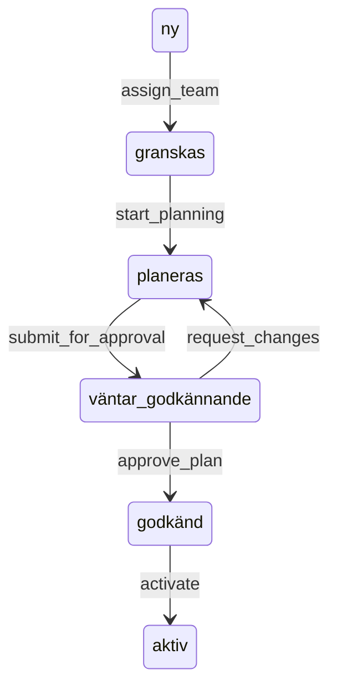
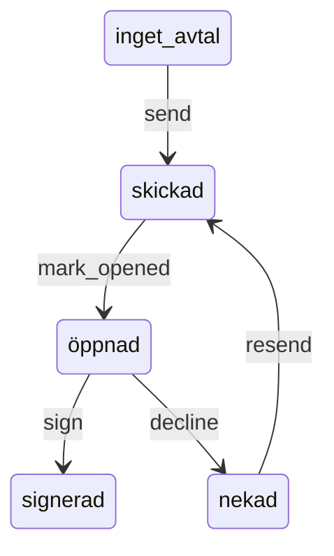
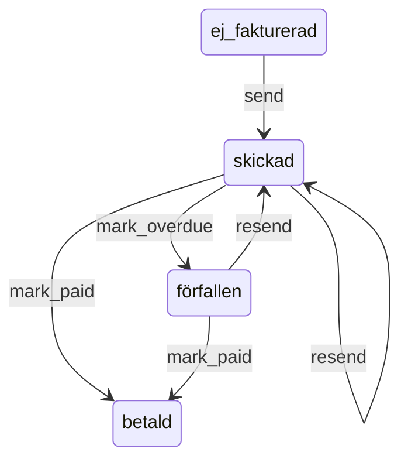
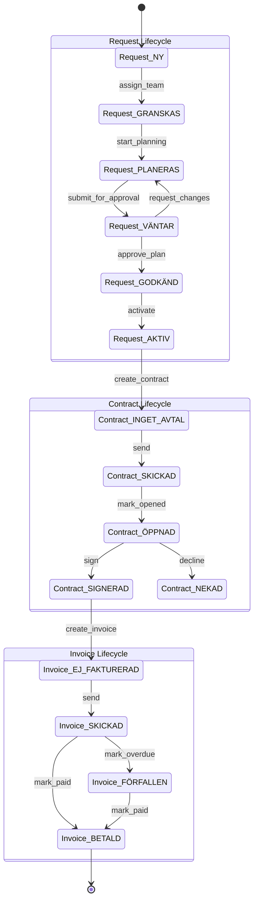

# Siteflow State Machine Architecture

Complete guide to implementing Siteflow's multi-phase workflow system using Ash Framework's AshStateMachine extension.

**Research Date:** 2025-11-15
**Status:** Production-ready patterns for Ash Framework 3.x
**Recommended Implementation:** AshStateMachine + AshOban + Notifiers

---

## Table of Contents

1. [State Machine Pattern Recommendation](#state-machine-pattern-recommendation)
2. [Complete Implementation Examples](#complete-implementation-examples)
3. [Database Schema Design](#database-schema-design)
4. [Side Effects and Notifications](#side-effects-and-notifications)
5. [Testing Strategies](#testing-strategies)
6. [Visualization](#visualization)
7. [Error Handling](#error-handling)

---

## State Machine Pattern Recommendation

### Recommended Stack

**Primary:** AshStateMachine (Ash Framework extension)
- Declarative state machine definitions
- Built-in transition validation
- Integrates with Ash policies and actions
- Automatic chart generation via Mermaid

**Background Jobs:** AshOban
- Reliable background processing
- Triggered actions based on state changes
- Scheduled actions for time-based transitions
- Transaction-safe job creation

**Real-time Notifications:** Ash Notifiers
- Post-transaction side effects
- Email notifications on state changes
- Analytics/logging integration
- PubSub for real-time updates

### Why AshStateMachine?

1. **Declarative:** States and transitions defined in resource schema
2. **Type-safe:** Leverages Ash's type system and validations
3. **Authorization-aware:** Works with Ash policies (`Ash.can?/3`)
4. **Transaction-safe:** All changes within Ecto transactions
5. **Composable:** Combines with AshOban for automated workflows
6. **Observable:** Built-in chart generation and audit capabilities

### Alternative Libraries (Not Recommended)

- **Machinery:** Good for simple cases, but no Ash integration
- **Fsmx:** Ecto-friendly, but lacks Ash's policy/validation system
- **ExState:** Database-backed statecharts, but redundant with Ash
- **StateMc:** Minimal DSL, lacks enterprise features

---

## Complete Implementation Examples

### Phase 1-5: Request Lifecycle

**States:** `NY` → `GRANSKAS` → `PLANERAS` → `VÄNTAR_GODKÄNNANDE` → `GODKÄND` → `AKTIV`

#### Request Resource Definition

```elixir
defmodule Siteflow.Requests.Request do
  use Ash.Resource,
    domain: Siteflow.Requests,
    data_layer: AshPostgres.DataLayer,
    extensions: [AshStateMachine],
    notifiers: [Siteflow.Requests.RequestNotifier]

  postgres do
    table "requests"
    repo Siteflow.Repo
  end

  # ============================================================================
  # STATE MACHINE CONFIGURATION
  # ============================================================================

  state_machine do
    initial_states [:ny]
    default_initial_state :ny

    transitions do
      # NY → GRANSKAS: Admin assigns team
      transition :assign_team, from: :ny, to: :granskas

      # GRANSKAS → PLANERAS: Team starts planning
      transition :start_planning, from: :granskas, to: :planeras

      # PLANERAS → VÄNTAR_GODKÄNNANDE: Planning complete
      transition :submit_for_approval, from: :planeras, to: :väntar_godkännande

      # VÄNTAR_GODKÄNNANDE → PLANERAS: Customer requests changes
      transition :request_changes, from: :väntar_godkännande, to: :planeras

      # VÄNTAR_GODKÄNNANDE → GODKÄND: Customer approves
      transition :approve_plan, from: :väntar_godkännande, to: :godkänd

      # GODKÄND → AKTIV: Automatic transition (via Oban trigger)
      transition :activate, from: :godkänd, to: :aktiv
    end
  end

  # ============================================================================
  # ATTRIBUTES
  # ============================================================================

  attributes do
    uuid_primary_key :id

    # State machine status (managed by AshStateMachine)
    attribute :status, :atom do
      allow_nil? false
      default :ny
      public? true
      constraints one_of: [
        :ny,
        :granskas,
        :planeras,
        :väntar_godkännande,
        :godkänd,
        :aktiv
      ]
    end

    # Request details
    attribute :company_name, :string do
      allow_nil? false
      public? true
    end

    attribute :contact_email, :string do
      allow_nil? false
      public? true
    end

    attribute :project_type, :atom do
      allow_nil? false
      public? true
      constraints one_of: [:website, :system, :consulting]
    end

    attribute :description, :string do
      public? true
    end

    # Team assignment (triggers NY → GRANSKAS)
    attribute :assigned_team_member_id, :uuid do
      public? true
    end

    # Planning metadata
    attribute :planning_started_at, :utc_datetime_usec
    attribute :planning_completed_at, :utc_datetime_usec

    # Approval workflow
    attribute :submitted_for_approval_at, :utc_datetime_usec
    attribute :approved_at, :utc_datetime_usec
    attribute :approval_notes, :string

    # Rejection/feedback loop
    attribute :change_requests, {:array, :map} do
      public? true
      default []
    end

    # Document checklist (9 required documents)
    attribute :documents_status, :map do
      public? true
      default %{
        "projektplan" => false,
        "teknisk_specifikation" => false,
        "design_mockups" => false,
        "arkitektur_diagram" => false,
        "tidsplan" => false,
        "budget_kalkyl" => false,
        "riskanalys" => false,
        "testplan" => false,
        "leveransplan" => false
      }
    end

    timestamps()
  end

  # ============================================================================
  # RELATIONSHIPS
  # ============================================================================

  relationships do
    belongs_to :assigned_team_member, Siteflow.Accounts.TeamMember
    has_one :project, Siteflow.Projects.Project
  end

  # ============================================================================
  # VALIDATIONS
  # ============================================================================

  validations do
    # Cannot submit for approval unless all 9 documents are ready
    validate present([:planning_completed_at, :documents_status]),
      on: [:submit_for_approval]

    validate fn changeset, _context ->
      if changeset.action.name == :submit_for_approval do
        documents = Ash.Changeset.get_attribute(changeset, :documents_status)
        all_complete = documents |> Map.values() |> Enum.all?(&(&1 == true))

        if all_complete do
          :ok
        else
          {:error,
           field: :documents_status,
           message: "All 9 documents must be complete before submitting for approval"}
        end
      else
        :ok
      end
    end
  end

  # ============================================================================
  # CALCULATIONS
  # ============================================================================

  calculations do
    # Check if all documents are ready
    calculate :all_documents_ready, :boolean do
      calculation fn records, _context ->
        Enum.map(records, fn record ->
          record.documents_status
          |> Map.values()
          |> Enum.all?(&(&1 == true))
        end)
      end
    end

    # Days in current state
    calculate :days_in_current_state, :integer do
      calculation fn records, _context ->
        now = DateTime.utc_now()

        Enum.map(records, fn record ->
          DateTime.diff(now, record.updated_at, :day)
        end)
      end
    end
  end

  # ============================================================================
  # ACTIONS
  # ============================================================================

  actions do
    defaults [:read, :destroy]

    create :create do
      accept [:company_name, :contact_email, :project_type, :description]
    end

    # NY → GRANSKAS: Assign team member
    update :assign_team do
      accept [:assigned_team_member_id]

      validate present(:assigned_team_member_id)

      change transition_state(:granskas)

      change fn changeset, _context ->
        Ash.Changeset.force_change_attribute(
          changeset,
          :planning_started_at,
          DateTime.utc_now()
        )
      end
    end

    # GRANSKAS → PLANERAS: Start planning
    update :start_planning do
      # Dynamic transition based on readiness
      change fn changeset, _context ->
        team_assigned? =
          Ash.Changeset.get_attribute(changeset, :assigned_team_member_id) != nil

        if team_assigned? do
          AshStateMachine.transition_state(changeset, :planeras)
        else
          Ash.Changeset.add_error(
            changeset,
            field: :assigned_team_member_id,
            message: "Team member must be assigned before starting planning"
          )
        end
      end
    end

    # PLANERAS → VÄNTAR_GODKÄNNANDE: Submit for approval
    update :submit_for_approval do
      accept [:planning_completed_at]

      # Validation enforces all 9 documents must be ready
      change transition_state(:väntar_godkännande)

      change fn changeset, _context ->
        changeset
        |> Ash.Changeset.force_change_attribute(
          :submitted_for_approval_at,
          DateTime.utc_now()
        )
        |> Ash.Changeset.force_change_attribute(
          :planning_completed_at,
          DateTime.utc_now()
        )
      end
    end

    # VÄNTAR_GODKÄNNANDE → PLANERAS: Customer requests changes
    update :request_changes do
      accept [:change_requests]

      validate present(:change_requests)

      change transition_state(:planeras)

      change fn changeset, _context ->
        # Append new change requests to existing array
        existing_requests =
          Ash.Changeset.get_attribute(changeset, :change_requests) || []

        new_request = %{
          "requested_at" => DateTime.utc_now(),
          "reason" => Ash.Changeset.get_argument(changeset, :reason)
        }

        Ash.Changeset.force_change_attribute(
          changeset,
          :change_requests,
          existing_requests ++ [new_request]
        )
      end
    end

    # VÄNTAR_GODKÄNNANDE → GODKÄND: Approve plan
    update :approve_plan do
      accept [:approval_notes]

      change transition_state(:godkänd)

      change fn changeset, _context ->
        Ash.Changeset.force_change_attribute(
          changeset,
          :approved_at,
          DateTime.utc_now()
        )
      end
    end

    # GODKÄND → AKTIV: Activate (triggered automatically by Oban)
    update :activate do
      # This creates the Project entity
      change transition_state(:aktiv)

      change Siteflow.Requests.Changes.CreateProjectFromRequest
    end

    # Update document checklist
    update :update_documents do
      accept [:documents_status]
    end
  end

  # ============================================================================
  # POLICIES (Authorization)
  # ============================================================================

  policies do
    policy always() do
      # Enable Ash.can?/3 to check valid state transitions
      authorize_if AshStateMachine.Checks.ValidNextState
    end

    # Only admins can assign teams
    policy action(:assign_team) do
      authorize_if actor_attribute_equals(:role, :admin)
    end

    # Only team members can start planning
    policy action(:start_planning) do
      authorize_if actor_attribute_equals(:role, :team_member)
    end

    # Only customers can approve/request changes
    policy action([:approve_plan, :request_changes]) do
      authorize_if actor_attribute_equals(:role, :customer)
    end
  end

  # ============================================================================
  # CODE INTERFACE
  # ============================================================================

  code_interface do
    define :create
    define :read
    define :assign_team
    define :start_planning
    define :submit_for_approval
    define :request_changes
    define :approve_plan
    define :activate
    define :update_documents
  end
end
```

#### Custom Change: Create Project from Request

```elixir
defmodule Siteflow.Requests.Changes.CreateProjectFromRequest do
  @moduledoc """
  Creates a Project entity when a Request is activated (GODKÄND → AKTIV).
  This is a side effect of the state transition.
  """
  use Ash.Resource.Change

  def change(changeset, _opts, _context) do
    # Create project in after_transaction hook to ensure Request is saved first
    Ash.Changeset.after_transaction(changeset, fn
      changeset, {:ok, request} ->
        # Create customer first
        customer_result =
          Siteflow.Customers.Customer
          |> Ash.Changeset.for_create(:create, %{
            company_name: request.company_name,
            contact_email: request.contact_email,
            source: :request,
            request_id: request.id
          })
          |> Ash.create()

        case customer_result do
          {:ok, customer} ->
            # Create project
            project_result =
              Siteflow.Projects.Project
              |> Ash.Changeset.for_create(:create_from_request, %{
                request_id: request.id,
                customer_id: customer.id,
                project_type: request.project_type,
                assigned_team_member_id: request.assigned_team_member_id
              })
              |> Ash.create()

            case project_result do
              {:ok, _project} ->
                {:ok, request}

              {:error, error} ->
                {:error, error}
            end

          {:error, error} ->
            {:error, error}
        end

      _changeset, {:error, error} ->
        {:error, error}
    end)
  end
end
```

#### Notifier: Send Notifications on State Changes

```elixir
defmodule Siteflow.Requests.RequestNotifier do
  @moduledoc """
  Sends notifications when Request state changes.
  Notifiers run AFTER the transaction commits.
  """
  use Ash.Notifier

  alias Siteflow.Emails.RequestEmails

  def notify(%Ash.Notifier.Notification{
        resource: Siteflow.Requests.Request,
        action: %{name: :assign_team},
        data: request
      }) do
    # Send email to assigned team member
    RequestEmails.team_assigned_email(request)
    |> Siteflow.Mailer.deliver()

    :ok
  end

  def notify(%Ash.Notifier.Notification{
        action: %{name: :submit_for_approval},
        data: request
      }) do
    # Send email to customer for approval
    RequestEmails.approval_requested_email(request)
    |> Siteflow.Mailer.deliver()

    :ok
  end

  def notify(%Ash.Notifier.Notification{
        action: %{name: :request_changes},
        data: request
      }) do
    # Send email to team about requested changes
    RequestEmails.changes_requested_email(request)
    |> Siteflow.Mailer.deliver()

    :ok
  end

  def notify(%Ash.Notifier.Notification{
        action: %{name: :approve_plan},
        data: request
      }) do
    # Send email to team about approval
    RequestEmails.plan_approved_email(request)
    |> Siteflow.Mailer.deliver()

    :ok
  end

  def notify(%Ash.Notifier.Notification{
        action: %{name: :activate},
        data: request
      }) do
    # Send email to customer that project is active
    RequestEmails.project_activated_email(request)
    |> Siteflow.Mailer.deliver()

    :ok
  end

  # Ignore other actions
  def notify(_), do: :ok
end
```

#### Oban Trigger: Auto-activate Approved Requests

```elixir
defmodule Siteflow.Requests.Request do
  use Ash.Resource,
    # ... (previous config)
    extensions: [AshStateMachine, AshOban]

  # Add to existing resource definition:

  oban do
    triggers do
      # Automatically activate requests after approval
      trigger :auto_activate_approved_requests do
        # Run daily at 2 AM
        scheduler_cron "0 2 * * *"

        action :activate

        # Only activate requests that are:
        # - In GODKÄND state
        # - Approved more than 1 hour ago (cooling off period)
        where expr(
          status == :godkänd and
          approved_at < ago(1, :hour)
        )

        read_action :read
      end
    end

    scheduled_actions do
      # Send reminders for stale requests
      schedule :remind_stale_requests, "0 9 * * MON" do
        action fn _input, _context ->
          # Find requests in GRANSKAS state for > 7 days
          stale_requests =
            Siteflow.Requests.Request
            |> Ash.Query.filter(status == :granskas)
            |> Ash.Query.filter(updated_at < ago(7, :day))
            |> Ash.read!()

          # Send reminder emails
          Enum.each(stale_requests, fn request ->
            Siteflow.Emails.RequestEmails.stale_request_reminder(request)
            |> Siteflow.Mailer.deliver()
          end)

          {:ok, "Sent #{length(stale_requests)} reminder emails"}
        end
      end
    end
  end
end
```

---

### Phase 6: Contract Lifecycle

**States:** `INGET_AVTAL` → `SKICKAD` → `ÖPPNAD` → `SIGNERAD` / `NEKAD`

#### Contract Resource Definition

```elixir
defmodule Siteflow.Contracts.Contract do
  use Ash.Resource,
    domain: Siteflow.Contracts,
    data_layer: AshPostgres.DataLayer,
    extensions: [AshStateMachine, AshOban],
    notifiers: [Siteflow.Contracts.ContractNotifier]

  postgres do
    table "contracts"
    repo Siteflow.Repo
  end

  # ============================================================================
  # STATE MACHINE CONFIGURATION
  # ============================================================================

  state_machine do
    initial_states [:inget_avtal]
    default_initial_state :inget_avtal

    transitions do
      # INGET_AVTAL → SKICKAD: Admin sends contract
      transition :send, from: :inget_avtal, to: :skickad

      # SKICKAD → ÖPPNAD: Customer opens contract (tracking)
      transition :mark_opened, from: :skickad, to: :öppnad

      # ÖPPNAD → SIGNERAD: Customer signs
      transition :sign, from: :öppnad, to: :signerad

      # ÖPPNAD → NEKAD: Customer declines
      transition :decline, from: :öppnad, to: :nekad

      # Allow re-sending after decline
      transition :resend, from: :nekad, to: :skickad
    end
  end

  # ============================================================================
  # ATTRIBUTES
  # ============================================================================

  attributes do
    uuid_primary_key :id

    # State machine status
    attribute :status, :atom do
      allow_nil? false
      default :inget_avtal
      public? true
      constraints one_of: [:inget_avtal, :skickad, :öppnad, :signerad, :nekad]
    end

    # Contract details
    attribute :contract_number, :string do
      allow_nil? false
      public? true
    end

    attribute :contract_pdf_url, :string do
      public? true
    end

    attribute :total_amount, :decimal do
      allow_nil? false
      public? true
    end

    attribute :payment_terms, :string do
      default "Net 30"
      public? true
    end

    # Tracking
    attribute :sent_at, :utc_datetime_usec
    attribute :opened_at, :utc_datetime_usec
    attribute :signed_at, :utc_datetime_usec
    attribute :declined_at, :utc_datetime_usec
    attribute :decline_reason, :string

    # Digital signature
    attribute :signature_ip_address, :string
    attribute :signature_user_agent, :string
    attribute :signature_data, :map

    timestamps()
  end

  # ============================================================================
  # RELATIONSHIPS
  # ============================================================================

  relationships do
    belongs_to :project, Siteflow.Projects.Project do
      allow_nil? false
    end

    has_many :invoices, Siteflow.Invoices.Invoice
  end

  # ============================================================================
  # ACTIONS
  # ============================================================================

  actions do
    defaults [:read, :destroy]

    create :create do
      accept [
        :project_id,
        :contract_number,
        :contract_pdf_url,
        :total_amount,
        :payment_terms
      ]
    end

    # INGET_AVTAL → SKICKAD: Send contract
    update :send do
      change transition_state(:skickad)

      change fn changeset, _context ->
        Ash.Changeset.force_change_attribute(
          changeset,
          :sent_at,
          DateTime.utc_now()
        )
      end
    end

    # SKICKAD → ÖPPNAD: Mark as opened (tracking pixel/webhook)
    update :mark_opened do
      accept [:opened_at]

      change transition_state(:öppnad)

      change fn changeset, _context ->
        Ash.Changeset.force_change_attribute(
          changeset,
          :opened_at,
          DateTime.utc_now()
        )
      end
    end

    # ÖPPNAD → SIGNERAD: Sign contract
    update :sign do
      accept [:signature_ip_address, :signature_user_agent, :signature_data]

      validate present([:signature_ip_address, :signature_data])

      change transition_state(:signerad)

      change fn changeset, _context ->
        Ash.Changeset.force_change_attribute(
          changeset,
          :signed_at,
          DateTime.utc_now()
        )
      end

      # Create invoice after signing
      change after_transaction(fn
               _changeset, {:ok, contract} ->
                 # Create first invoice
                 Siteflow.Invoices.Invoice
                 |> Ash.Changeset.for_create(:create_from_contract, %{
                   contract_id: contract.id,
                   project_id: contract.project_id
                 })
                 |> Ash.create()

                 {:ok, contract}

               _changeset, error ->
                 error
             end)
    end

    # ÖPPNAD → NEKAD: Decline contract
    update :decline do
      accept [:decline_reason]

      validate present(:decline_reason)

      change transition_state(:nekad)

      change fn changeset, _context ->
        Ash.Changeset.force_change_attribute(
          changeset,
          :declined_at,
          DateTime.utc_now()
        )
      end
    end

    # NEKAD → SKICKAD: Re-send after decline
    update :resend do
      change transition_state(:skickad)

      change fn changeset, _context ->
        changeset
        |> Ash.Changeset.force_change_attribute(:sent_at, DateTime.utc_now())
        |> Ash.Changeset.force_change_attribute(:declined_at, nil)
        |> Ash.Changeset.force_change_attribute(:decline_reason, nil)
      end
    end
  end

  # ============================================================================
  # CALCULATIONS
  # ============================================================================

  calculations do
    # Days since sent
    calculate :days_since_sent, :integer do
      calculation fn records, _context ->
        now = DateTime.utc_now()

        Enum.map(records, fn record ->
          if record.sent_at do
            DateTime.diff(now, record.sent_at, :day)
          else
            nil
          end
        end)
      end
    end
  end

  # ============================================================================
  # OBAN TRIGGERS
  # ============================================================================

  oban do
    triggers do
      # Send reminders for unopened contracts
      trigger :remind_unopened_contracts do
        scheduler_cron "0 10 * * *"
        action :send_reminder

        where expr(
          status == :skickad and
          sent_at < ago(3, :day) and
          sent_at > ago(14, :day)
        )
      end
    end
  end

  # ============================================================================
  # POLICIES
  # ============================================================================

  policies do
    policy always() do
      authorize_if AshStateMachine.Checks.ValidNextState
    end

    policy action(:send) do
      authorize_if actor_attribute_equals(:role, :admin)
    end

    policy action([:sign, :decline]) do
      authorize_if actor_attribute_equals(:role, :customer)
    end
  end

  code_interface do
    define :create
    define :send
    define :mark_opened
    define :sign
    define :decline
    define :resend
  end
end
```

#### Contract Notifier

```elixir
defmodule Siteflow.Contracts.ContractNotifier do
  use Ash.Notifier
  alias Siteflow.Emails.ContractEmails

  def notify(%{action: %{name: :send}, data: contract}) do
    ContractEmails.contract_sent_email(contract)
    |> Siteflow.Mailer.deliver()

    :ok
  end

  def notify(%{action: %{name: :sign}, data: contract}) do
    # Notify admin
    ContractEmails.contract_signed_email(contract)
    |> Siteflow.Mailer.deliver()

    # Notify customer with confirmation
    ContractEmails.contract_confirmation_email(contract)
    |> Siteflow.Mailer.deliver()

    :ok
  end

  def notify(%{action: %{name: :decline}, data: contract}) do
    ContractEmails.contract_declined_email(contract)
    |> Siteflow.Mailer.deliver()

    :ok
  end

  def notify(_), do: :ok
end
```

---

### Phase 7: Invoice Lifecycle

**States:** `EJ_FAKTURERAD` → `SKICKAD` → `BETALD` / `FÖRFALLEN`

#### Invoice Resource Definition

```elixir
defmodule Siteflow.Invoices.Invoice do
  use Ash.Resource,
    domain: Siteflow.Invoices,
    data_layer: AshPostgres.DataLayer,
    extensions: [AshStateMachine, AshOban],
    notifiers: [Siteflow.Invoices.InvoiceNotifier]

  postgres do
    table "invoices"
    repo Siteflow.Repo
  end

  # ============================================================================
  # STATE MACHINE CONFIGURATION
  # ============================================================================

  state_machine do
    initial_states [:ej_fakturerad]
    default_initial_state :ej_fakturerad

    transitions do
      # EJ_FAKTURERAD → SKICKAD: Admin sends invoice
      transition :send, from: :ej_fakturerad, to: :skickad

      # SKICKAD → BETALD: Payment received
      transition :mark_paid, from: :skickad, to: :betald

      # SKICKAD → FÖRFALLEN: Automated (past due date)
      transition :mark_overdue, from: :skickad, to: :förfallen

      # FÖRFALLEN → BETALD: Late payment received
      transition :mark_paid, from: :förfallen, to: :betald

      # Allow re-sending
      transition :resend, from: [:skickad, :förfallen], to: :skickad
    end
  end

  # ============================================================================
  # ATTRIBUTES
  # ============================================================================

  attributes do
    uuid_primary_key :id

    # State machine status
    attribute :status, :atom do
      allow_nil? false
      default :ej_fakturerad
      public? true
      constraints one_of: [:ej_fakturerad, :skickad, :betald, :förfallen]
    end

    # Invoice details
    attribute :invoice_number, :string do
      allow_nil? false
      public? true
    end

    attribute :invoice_pdf_url, :string do
      public? true
    end

    attribute :amount, :decimal do
      allow_nil? false
      public? true
    end

    attribute :due_date, :date do
      allow_nil? false
      public? true
    end

    attribute :description, :string do
      public? true
    end

    # Tracking
    attribute :sent_at, :utc_datetime_usec
    attribute :paid_at, :utc_datetime_usec
    attribute :payment_method, :string
    attribute :payment_reference, :string

    # Reminders
    attribute :reminder_count, :integer do
      default 0
    end

    attribute :last_reminder_sent_at, :utc_datetime_usec

    timestamps()
  end

  # ============================================================================
  # RELATIONSHIPS
  # ============================================================================

  relationships do
    belongs_to :contract, Siteflow.Contracts.Contract do
      allow_nil? false
    end

    belongs_to :project, Siteflow.Projects.Project do
      allow_nil? false
    end
  end

  # ============================================================================
  # CALCULATIONS
  # ============================================================================

  calculations do
    # Is overdue?
    calculate :is_overdue, :boolean do
      calculation fn records, _context ->
        today = Date.utc_today()

        Enum.map(records, fn record ->
          record.status == :skickad and Date.compare(today, record.due_date) == :gt
        end)
      end
    end

    # Days until due
    calculate :days_until_due, :integer do
      calculation fn records, _context ->
        today = Date.utc_today()

        Enum.map(records, fn record ->
          Date.diff(record.due_date, today)
        end)
      end
    end

    # Days overdue
    calculate :days_overdue, :integer do
      calculation fn records, _context ->
        today = Date.utc_today()

        Enum.map(records, fn record ->
          if record.status in [:skickad, :förfallen] and
               Date.compare(today, record.due_date) == :gt do
            Date.diff(today, record.due_date)
          else
            0
          end
        end)
      end
    end
  end

  # ============================================================================
  # ACTIONS
  # ============================================================================

  actions do
    defaults [:read, :destroy]

    create :create do
      accept [:invoice_number, :amount, :due_date, :description]
    end

    create :create_from_contract do
      accept [:contract_id, :project_id]

      change fn changeset, _context ->
        # Generate invoice number
        invoice_number = "INV-#{:rand.uniform(999_999)}"

        # Set due date to 30 days from now
        due_date = Date.add(Date.utc_today(), 30)

        changeset
        |> Ash.Changeset.force_change_attribute(:invoice_number, invoice_number)
        |> Ash.Changeset.force_change_attribute(:due_date, due_date)
      end
    end

    # EJ_FAKTURERAD → SKICKAD: Send invoice
    update :send do
      change transition_state(:skickad)

      change fn changeset, _context ->
        Ash.Changeset.force_change_attribute(
          changeset,
          :sent_at,
          DateTime.utc_now()
        )
      end
    end

    # SKICKAD/FÖRFALLEN → BETALD: Mark as paid
    update :mark_paid do
      accept [:payment_method, :payment_reference]

      change transition_state(:betald)

      change fn changeset, _context ->
        Ash.Changeset.force_change_attribute(
          changeset,
          :paid_at,
          DateTime.utc_now()
        )
      end
    end

    # SKICKAD → FÖRFALLEN: Mark as overdue (automated)
    update :mark_overdue do
      change transition_state(:förfallen)
    end

    # Re-send invoice
    update :resend do
      change transition_state(:skickad)

      change fn changeset, _context ->
        Ash.Changeset.force_change_attribute(
          changeset,
          :sent_at,
          DateTime.utc_now()
        )
      end
    end

    # Send reminder (doesn't change state)
    update :send_reminder do
      change fn changeset, _context ->
        reminder_count = Ash.Changeset.get_attribute(changeset, :reminder_count)

        changeset
        |> Ash.Changeset.force_change_attribute(:reminder_count, reminder_count + 1)
        |> Ash.Changeset.force_change_attribute(
          :last_reminder_sent_at,
          DateTime.utc_now()
        )
      end
    end
  end

  # ============================================================================
  # OBAN TRIGGERS (Time-based automation)
  # ============================================================================

  oban do
    triggers do
      # Mark overdue invoices (runs daily at 1 AM)
      trigger :mark_overdue_invoices do
        scheduler_cron "0 1 * * *"
        action :mark_overdue

        where expr(
          status == :skickad and
          due_date < today()
        )
      end

      # Send first reminder (3 days before due)
      trigger :send_pre_due_reminders do
        scheduler_cron "0 9 * * *"
        action :send_reminder

        where expr(
          status == :skickad and
          due_date == from_now(3, :day) and
          reminder_count == 0
        )
      end

      # Send overdue reminders (every 7 days)
      trigger :send_overdue_reminders do
        scheduler_cron "0 9 * * *"
        action :send_reminder

        where expr(
          status in [:skickad, :förfallen] and
          due_date < today() and
          (is_nil(last_reminder_sent_at) or
             last_reminder_sent_at < ago(7, :day))
        )
      end
    end
  end

  # ============================================================================
  # POLICIES
  # ============================================================================

  policies do
    policy always() do
      authorize_if AshStateMachine.Checks.ValidNextState
    end

    policy action(:send) do
      authorize_if actor_attribute_equals(:role, :admin)
    end

    policy action(:mark_paid) do
      authorize_if actor_attribute_equals(:role, :admin)
    end
  end

  code_interface do
    define :create
    define :create_from_contract
    define :send
    define :mark_paid
    define :mark_overdue
    define :resend
    define :send_reminder
  end
end
```

#### Invoice Notifier

```elixir
defmodule Siteflow.Invoices.InvoiceNotifier do
  use Ash.Notifier
  alias Siteflow.Emails.InvoiceEmails

  def notify(%{action: %{name: :send}, data: invoice}) do
    InvoiceEmails.invoice_sent_email(invoice)
    |> Siteflow.Mailer.deliver()

    :ok
  end

  def notify(%{action: %{name: :send_reminder}, data: invoice}) do
    if invoice.status == :förfallen do
      InvoiceEmails.overdue_reminder_email(invoice)
      |> Siteflow.Mailer.deliver()
    else
      InvoiceEmails.payment_reminder_email(invoice)
      |> Siteflow.Mailer.deliver()
    end

    :ok
  end

  def notify(%{action: %{name: :mark_paid}, data: invoice}) do
    InvoiceEmails.payment_received_email(invoice)
    |> Siteflow.Mailer.deliver()

    :ok
  end

  def notify(%{action: %{name: :mark_overdue}, data: invoice}) do
    # Notify admin about overdue invoice
    InvoiceEmails.invoice_overdue_alert(invoice)
    |> Siteflow.Mailer.deliver()

    :ok
  end

  def notify(_), do: :ok
end
```

---

## Database Schema Design

### Migration Example: Requests Table

```elixir
defmodule Siteflow.Repo.Migrations.CreateRequests do
  use Ecto.Migration

  def change do
    create table(:requests, primary_key: false) do
      add :id, :uuid, primary_key: true, default: fragment("gen_random_uuid()")

      # State machine status (string-backed enum for readability)
      add :status, :string, null: false, default: "ny"

      # Request details
      add :company_name, :string, null: false
      add :contact_email, :string, null: false
      add :project_type, :string, null: false
      add :description, :text

      # Team assignment
      add :assigned_team_member_id, references(:team_members, type: :uuid)

      # Planning metadata
      add :planning_started_at, :utc_datetime_usec
      add :planning_completed_at, :utc_datetime_usec

      # Approval workflow
      add :submitted_for_approval_at, :utc_datetime_usec
      add :approved_at, :utc_datetime_usec
      add :approval_notes, :text

      # Rejection/feedback loop
      add :change_requests, :jsonb, default: "[]"

      # Document checklist (JSONB for flexibility)
      add :documents_status, :jsonb,
        default: """
        {
          "projektplan": false,
          "teknisk_specifikation": false,
          "design_mockups": false,
          "arkitektur_diagram": false,
          "tidsplan": false,
          "budget_kalkyl": false,
          "riskanalys": false,
          "testplan": false,
          "leveransplan": false
        }
        """

      timestamps(type: :utc_datetime_usec)
    end

    # Indexes for querying by status
    create index(:requests, [:status])
    create index(:requests, [:assigned_team_member_id])
    create index(:requests, [:updated_at])

    # Composite index for Oban triggers
    create index(:requests, [:status, :approved_at])
    create index(:requests, [:status, :updated_at])

    # Check constraint for valid status values
    create constraint(:requests, :valid_status,
             check: """
             status IN ('ny', 'granskas', 'planeras', 'väntar_godkännande', 'godkänd', 'aktiv')
             """
           )
  end
end
```

### Migration Example: Contracts Table

```elixir
defmodule Siteflow.Repo.Migrations.CreateContracts do
  use Ecto.Migration

  def change do
    create table(:contracts, primary_key: false) do
      add :id, :uuid, primary_key: true, default: fragment("gen_random_uuid()")

      # State machine status
      add :status, :string, null: false, default: "inget_avtal"

      # Contract details
      add :contract_number, :string, null: false
      add :contract_pdf_url, :text
      add :total_amount, :decimal, precision: 10, scale: 2, null: false
      add :payment_terms, :string, default: "Net 30"

      # Relationships
      add :project_id, references(:projects, type: :uuid), null: false

      # Tracking
      add :sent_at, :utc_datetime_usec
      add :opened_at, :utc_datetime_usec
      add :signed_at, :utc_datetime_usec
      add :declined_at, :utc_datetime_usec
      add :decline_reason, :text

      # Digital signature
      add :signature_ip_address, :string
      add :signature_user_agent, :text
      add :signature_data, :jsonb

      timestamps(type: :utc_datetime_usec)
    end

    create unique_index(:contracts, [:contract_number])
    create index(:contracts, [:status])
    create index(:contracts, [:project_id])

    # Composite index for Oban triggers (unopened contracts)
    create index(:contracts, [:status, :sent_at])

    create constraint(:contracts, :valid_status,
             check: """
             status IN ('inget_avtal', 'skickad', 'öppnad', 'signerad', 'nekad')
             """
           )
  end
end
```

### Migration Example: Invoices Table

```elixir
defmodule Siteflow.Repo.Migrations.CreateInvoices do
  use Ecto.Migration

  def change do
    create table(:invoices, primary_key: false) do
      add :id, :uuid, primary_key: true, default: fragment("gen_random_uuid()")

      # State machine status
      add :status, :string, null: false, default: "ej_fakturerad"

      # Invoice details
      add :invoice_number, :string, null: false
      add :invoice_pdf_url, :text
      add :amount, :decimal, precision: 10, scale: 2, null: false
      add :due_date, :date, null: false
      add :description, :text

      # Relationships
      add :contract_id, references(:contracts, type: :uuid), null: false
      add :project_id, references(:projects, type: :uuid), null: false

      # Tracking
      add :sent_at, :utc_datetime_usec
      add :paid_at, :utc_datetime_usec
      add :payment_method, :string
      add :payment_reference, :string

      # Reminders
      add :reminder_count, :integer, default: 0
      add :last_reminder_sent_at, :utc_datetime_usec

      timestamps(type: :utc_datetime_usec)
    end

    create unique_index(:invoices, [:invoice_number])
    create index(:invoices, [:status])
    create index(:invoices, [:contract_id])
    create index(:invoices, [:project_id])

    # Composite indexes for Oban triggers
    create index(:invoices, [:status, :due_date])
    create index(:invoices, [:status, :due_date, :reminder_count])
    create index(:invoices, [:status, :due_date, :last_reminder_sent_at])

    create constraint(:invoices, :valid_status,
             check: """
             status IN ('ej_fakturerad', 'skickad', 'betald', 'förfallen')
             """
           )
  end
end
```

### Schema Design Recommendations

**1. Status Field Type:**
- **Use:** String-backed enums (`:string` in database, `:atom` in Ecto.Enum)
- **Why:**
  - Readable in database queries and tools
  - Easy to add new states (no DDL changes)
  - Works well with indexes
  - Avoids PostgreSQL ENUM type limitations

**2. Audit Trail:**
- **Approach:** Use timestamp fields for each state transition
- **Benefits:**
  - Simple queries for "time in state"
  - No separate audit table needed for common cases
  - Good performance

**3. Composite Indexes for Oban:**
```sql
-- For finding records in specific state + time range
CREATE INDEX idx_oban_triggers ON requests (status, updated_at);
CREATE INDEX idx_oban_invoices ON invoices (status, due_date);
```

**4. JSONB for Flexible Data:**
- Use for: Document checklists, change requests, signature data
- Enables: GIN indexes, JSON operators, schema evolution

---

## Side Effects and Notifications

### Pattern 1: Notifiers (Post-transaction)

**Use for:**
- Sending emails
- Logging to analytics
- Publishing to PubSub
- Triggering webhooks

**Example:**
```elixir
defmodule MyApp.MyNotifier do
  use Ash.Notifier

  def notify(%Ash.Notifier.Notification{
        resource: MyResource,
        action: %{name: :some_action},
        data: record
      }) do
    # Send email
    MyApp.Emails.send_email(record)

    # Log to analytics
    MyApp.Analytics.track("action_completed", record)

    # Publish to PubSub
    Phoenix.PubSub.broadcast(
      MyApp.PubSub,
      "records:#{record.id}",
      {:action_completed, record}
    )

    :ok
  end

  def notify(_), do: :ok
end
```

**Important:**
- Notifiers fire AFTER transaction commits
- They receive ALL create/update/destroy actions
- Pattern match on `action.name` to filter
- Return `:ok` for actions you don't care about
- Keep work lightweight (delegate heavy tasks to GenServers/Oban)

### Pattern 2: Change Modules (In-transaction)

**Use for:**
- Creating related entities
- Updating related records
- Complex validations
- Data transformations

**Example:**
```elixir
defmodule MyApp.Changes.CreateInvoiceAfterSigning do
  use Ash.Resource.Change

  def change(changeset, _opts, _context) do
    # Use after_transaction to access saved record
    Ash.Changeset.after_transaction(changeset, fn
      _changeset, {:ok, contract} ->
        # Create invoice
        result =
          MyApp.Invoice
          |> Ash.Changeset.for_create(:create, %{
            contract_id: contract.id,
            amount: contract.total_amount
          })
          |> Ash.create()

        case result do
          {:ok, _invoice} -> {:ok, contract}
          {:error, error} -> {:error, error}
        end

      _changeset, {:error, error} ->
        {:error, error}
    end)
  end
end
```

**Important:**
- Changes run WITHIN the transaction
- Use `after_transaction` to create related entities
- Errors will rollback the entire transaction
- Good for maintaining data consistency

### Pattern 3: Oban Triggers (Automated)

**Use for:**
- Time-based state transitions
- Periodic cleanup
- Scheduled reminders
- Background processing

**Example:**
```elixir
oban do
  triggers do
    # Run action for matching records
    trigger :auto_archive_completed_projects do
      scheduler_cron "0 2 * * *"  # Daily at 2 AM
      action :archive

      where expr(
        status == :completed and
        completed_at < ago(90, :day)
      )
    end
  end

  scheduled_actions do
    # Run custom logic on schedule
    schedule :cleanup_temp_files, "0 3 * * *" do
      action fn _input, _context ->
        # Custom cleanup logic
        File.rm_rf!("/tmp/siteflow")
        {:ok, "Cleaned up temp files"}
      end
    end
  end
end
```

**Important:**
- Triggers run actions for EACH matching record
- Scheduled actions run ONCE on schedule
- Use `where` expressions to filter records
- Cron syntax for scheduling

---

## Testing Strategies

### Unit Testing State Transitions

```elixir
defmodule Siteflow.RequestsTest do
  use Siteflow.DataCase
  alias Siteflow.Requests.Request

  describe "state transitions" do
    test "can transition from NY to GRANSKAS when team assigned" do
      # Create request
      request =
        Request
        |> Ash.Changeset.for_create(:create, %{
          company_name: "Test Co",
          contact_email: "test@example.com",
          project_type: :website
        })
        |> Ash.create!()

      assert request.status == :ny

      # Assign team
      team_member = create_team_member()

      request =
        request
        |> Ash.Changeset.for_update(:assign_team, %{
          assigned_team_member_id: team_member.id
        })
        |> Ash.update!()

      assert request.status == :granskas
      assert request.assigned_team_member_id == team_member.id
    end

    test "cannot submit for approval without all documents ready" do
      request = create_request_in_state(:planeras)

      # Try to submit without documents
      assert_raise Ash.Error.Invalid, fn ->
        request
        |> Ash.Changeset.for_update(:submit_for_approval, %{})
        |> Ash.update!()
      end
    end

    test "can request changes and return to planning" do
      request = create_request_in_state(:väntar_godkännande)

      request =
        request
        |> Ash.Changeset.for_update(:request_changes, %{
          change_requests: [%{"reason" => "Need more details"}]
        })
        |> Ash.update!()

      assert request.status == :planeras
      assert length(request.change_requests) == 1
    end
  end

  describe "validations" do
    test "enforces all 9 documents ready before approval" do
      request = create_request_in_state(:planeras)

      # Set 8/9 documents ready
      incomplete_docs =
        Map.new(1..8, fn i ->
          {"doc_#{i}", true}
        end)
        |> Map.put("doc_9", false)

      request =
        request
        |> Ash.Changeset.for_update(:update_documents, %{
          documents_status: incomplete_docs
        })
        |> Ash.update!()

      # Try to submit
      assert_raise Ash.Error.Invalid, ~r/All 9 documents/, fn ->
        request
        |> Ash.Changeset.for_update(:submit_for_approval, %{})
        |> Ash.update!()
      end
    end
  end

  describe "Ash.can? integration" do
    test "returns false for invalid transitions" do
      request = create_request_in_state(:ny)

      # Cannot approve from NY state
      refute Ash.can?(
               {Request, :approve_plan},
               %{id: request.id},
               actor: nil
             )
    end

    test "returns true for valid transitions" do
      request = create_request_in_state(:väntar_godkännande)

      assert Ash.can?(
               {Request, :approve_plan},
               %{id: request.id},
               actor: create_customer()
             )
    end
  end
end
```

### Property-Based Testing with StreamData

```elixir
defmodule Siteflow.RequestPropertyTest do
  use ExUnit.Case, async: true
  use ExUnitProperties

  alias Siteflow.Requests.Request

  property "request always ends in valid final state" do
    check all actions <- list_of(request_action_generator(), min_length: 1, max_length: 20) do
      request = create_request()

      final_request =
        Enum.reduce(actions, request, fn action, req ->
          case apply_action(req, action) do
            {:ok, updated} -> updated
            {:error, _} -> req  # Invalid transition, stay in current state
          end
        end)

      assert final_request.status in [
               :ny,
               :granskas,
               :planeras,
               :väntar_godkännande,
               :godkänd,
               :aktiv
             ]
    end
  end

  defp request_action_generator do
    StreamData.one_of([
      StreamData.constant(:assign_team),
      StreamData.constant(:start_planning),
      StreamData.constant(:submit_for_approval),
      StreamData.constant(:request_changes),
      StreamData.constant(:approve_plan),
      StreamData.constant(:activate)
    ])
  end

  defp apply_action(request, action) do
    # Apply action with appropriate params
    # Return {:ok, request} or {:error, reason}
  end
end
```

### Integration Testing with Oban

```elixir
defmodule Siteflow.InvoiceObanTest do
  use Siteflow.DataCase
  use Oban.Testing, repo: Siteflow.Repo

  alias Siteflow.Invoices.Invoice

  test "marks overdue invoices automatically" do
    # Create invoice with past due date
    invoice =
      Invoice
      |> Ash.Changeset.for_create(:create, %{
        invoice_number: "INV-001",
        amount: Decimal.new("1000.00"),
        due_date: Date.add(Date.utc_today(), -5)
      })
      |> Ash.create!()

    invoice =
      invoice
      |> Ash.Changeset.for_update(:send, %{})
      |> Ash.update!()

    assert invoice.status == :skickad

    # Manually trigger Oban job
    assert :ok = perform_job(Invoice, :mark_overdue_invoices)

    # Reload invoice
    invoice = Ash.get!(Invoice, invoice.id)

    assert invoice.status == :förfallen
  end

  test "sends reminders for overdue invoices" do
    invoice = create_overdue_invoice()

    # Trigger reminder job
    assert :ok = perform_job(Invoice, :send_overdue_reminders)

    # Check reminder was sent
    invoice = Ash.get!(Invoice, invoice.id)

    assert invoice.reminder_count == 1
    assert invoice.last_reminder_sent_at != nil
  end
end
```

### Testing Notifiers

```elixir
defmodule Siteflow.ContractNotifierTest do
  use Siteflow.DataCase
  import Swoosh.TestAssertions

  alias Siteflow.Contracts.Contract

  test "sends email when contract is signed" do
    contract = create_contract()

    contract =
      contract
      |> Ash.Changeset.for_update(:sign, %{
        signature_ip_address: "127.0.0.1",
        signature_data: %{"signature" => "base64..."}
      })
      |> Ash.update!()

    # Assert email was sent
    assert_email_sent(
      subject: "Contract Signed",
      to: contract.project.customer.contact_email
    )
  end
end
```

---

## Visualization

### Generate Mermaid Charts

```bash
# Generate charts for all resources with state machines
mix ash_state_machine.generate_flow_charts
```

### Request Lifecycle Chart



### Contract Lifecycle Chart



### Invoice Lifecycle Chart



### Complete System Flow Chart



---

## Error Handling

### Pattern 1: Validation Errors

```elixir
# In action definition
update :submit_for_approval do
  validate present(:planning_completed_at),
    message: "Planning must be completed before submitting"

  validate fn changeset, _context ->
    documents = Ash.Changeset.get_attribute(changeset, :documents_status)

    if all_documents_ready?(documents) do
      :ok
    else
      {:error,
       field: :documents_status,
       message: "All 9 documents must be complete"}
    end
  end
end
```

**Handling:**
```elixir
case Ash.update(changeset) do
  {:ok, request} ->
    # Success
    request

  {:error, %Ash.Error.Invalid{errors: errors}} ->
    # Validation failed
    errors
    |> Enum.map(& &1.message)
    |> Enum.join(", ")
    |> IO.puts()
end
```

### Pattern 2: Invalid State Transitions

AshStateMachine automatically prevents invalid transitions:

```elixir
# Try to approve from wrong state
request = create_request_in_state(:ny)

request
|> Ash.Changeset.for_update(:approve_plan, %{})
|> Ash.update()
# => {:error, "Cannot transition from :ny to :godkänd"}
```

**UI Integration:**
```elixir
# Check if action is allowed before showing button
if Ash.can?({Request, :approve_plan}, request, actor: current_user) do
  render_approve_button()
end
```

### Pattern 3: Transaction Rollback

Changes that create related entities will rollback on error:

```elixir
defmodule CreateInvoiceChange do
  use Ash.Resource.Change

  def change(changeset, _opts, _context) do
    Ash.Changeset.after_transaction(changeset, fn
      _changeset, {:ok, contract} ->
        # This runs in same transaction
        case create_invoice(contract) do
          {:ok, _invoice} ->
            {:ok, contract}

          {:error, error} ->
            # Returning error rolls back contract creation too
            {:error, error}
        end

      _changeset, error ->
        error
    end)
  end
end
```

### Pattern 4: Notifier Failures

Notifiers should handle errors gracefully:

```elixir
defmodule MyNotifier do
  use Ash.Notifier
  require Logger

  def notify(notification) do
    try do
      send_email(notification.data)
      :ok
    rescue
      error ->
        # Log error but don't crash
        Logger.error("Failed to send email: #{inspect(error)}")
        :ok
    end
  end
end
```

**Important:** Notifier errors don't rollback transactions (they run after commit).

### Pattern 5: Oban Job Failures

Oban automatically retries failed jobs:

```elixir
oban do
  triggers do
    trigger :send_reminders do
      scheduler_cron "0 9 * * *"
      action :send_reminder

      # Oban config for retries
      max_attempts 3
      priority 1
    end
  end
end
```

**Monitor failures:**
```elixir
# In Oban dashboard or custom monitoring
defmodule MyApp.ObanReporter do
  use Oban.Notifier

  def handle_event([:oban, :job, :exception], _measure, meta, _config) do
    Logger.error("Oban job failed: #{inspect(meta)}")
  end
end
```

---

## Best Practices Summary

### 1. State Machine Design

- Keep states atomic and well-defined
- Use Swedish names matching business terminology
- Document valid transitions in Mermaid charts
- Use validations to enforce business rules

### 2. Side Effects

- **Notifiers:** Email, logging, PubSub (post-transaction)
- **Changes:** Create related entities (in-transaction)
- **Oban:** Time-based automation, heavy background work

### 3. Database Schema

- Use string-backed enums for flexibility
- Add timestamp fields for each state transition
- Create composite indexes for Oban queries
- Use JSONB for flexible nested data

### 4. Testing

- Unit test all valid transitions
- Test validation rules block invalid transitions
- Test side effects (notifiers, entity creation)
- Use property-based testing for complex workflows
- Integration test Oban triggers

### 5. Error Handling

- Validate early (in actions/validations)
- Use `after_transaction` for related entity creation
- Handle notifier errors gracefully (log, don't crash)
- Configure Oban retries for background jobs

---

## Additional Resources

- **AshStateMachine Docs:** https://hexdocs.pm/ash_state_machine
- **AshOban Docs:** https://hexdocs.pm/ash_oban
- **Ash Framework:** https://ash-hq.org
- **Mermaid State Diagrams:** https://mermaid.js.org/syntax/stateDiagram.html
- **Property-Based Testing (Elixir):** https://hexdocs.pm/stream_data

---

**Document Version:** 1.0
**Last Updated:** 2025-11-15
**Author:** Claude Code (Anthropic)
